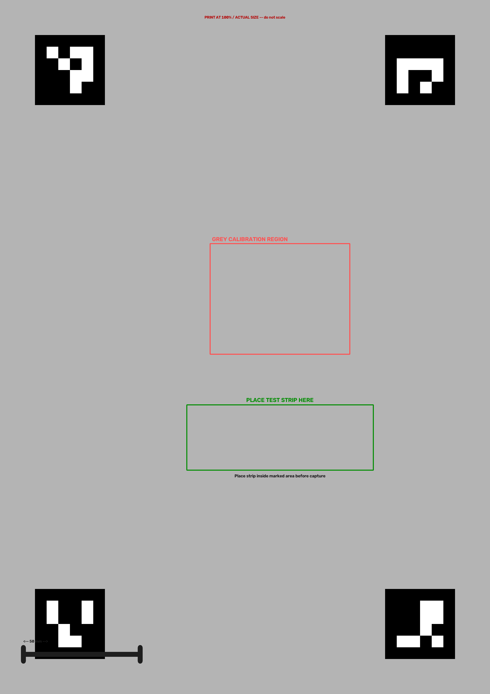

# 🔬 NarcScan

### **Detect. Decide. Defend.**

> **Smart India Hackathon 2026 · PS ID: SIH26231 · Team DoomsCoding**
>
> A computer-vision-assisted field screening platform for **rapid, standardized, auditable analysis of colorimetric narcotic-drug test reactions**.

NarcScan is being engineered around a simple field reality: a chemical test may produce a visible colour change, but **human interpretation of that colour is subjective** and can vary with lighting, camera angle, paper position and operator judgement.

NarcScan turns that visual observation into a reproducible digital pipeline:

**Capture → Detect → Rectify → Calibrate → Isolate → Measure → Compare → Report**

The current repository contains the backend computer-vision and colour-analysis core. The Flutter mobile layer is the planned field interface for the complete product.

---

## ⚡ What makes NarcScan different?

Most simple camera-based demos stop at **"look at the colour and classify it."**

NarcScan deliberately goes further — and deliberately refuses to overclaim.

| Problem | NarcScan approach |
|---|---|
| 📐 Phone held at an angle | **ArUco fiducials + homography** rectify the card |
| 💡 Different lighting / colour cast | **Physical grey reference** provides per-channel calibration |
| 🎯 Operator selecting pixels manually | **Fixed physical test-strip ROI** generated from an A4 template |
| 🎨 RGB is device-dependent | Analysis is performed in **CIELAB** |
| 📏 Naive RGB distance | **CIEDE2000 (ΔE₀₀)** for perceptual colour difference |
| 🧪 Reaction is not a single pixel | **Regional statistics + reaction features** capture spatial variation |
| 📚 Missing trustworthy reference data | Reference profiles carry **source + validation status** |
| ⚠️ Risk of false certainty | Classifier is designed to **fail safely instead of inventing a result** |

> **Core principle:** a working prototype is not allowed to become a fake scientific instrument just because a demo needs a green "POSITIVE" button.

---

## 🧠 The Computer-Vision Pipeline

```text
                    ┌──────────────────────┐
                    │   Phone / Camera     │
                    │   Field Photograph   │
                    └──────────┬───────────┘
                               │
                               ▼
                 ┌─────────────────────────┐
                 │  1. ArUco Detection     │
                 │  IDs 0 · 1 · 2 · 3      │
                 └────────────┬────────────┘
                              │
                              ▼
                 ┌─────────────────────────┐
                 │  2. Perspective Warp    │
                 │  Homography → flat card │
                 └────────────┬────────────┘
                              │
                              ▼
                 ┌─────────────────────────┐
                 │  3. Grey Calibration    │
                 │  B/G/R channel gains    │
                 └────────────┬────────────┘
                              │
                              ▼
                 ┌─────────────────────────┐
                 │  4. Fixed Strip ROI     │
                 │  Physical A4 geometry   │
                 └────────────┬────────────┘
                              │
                              ▼
                 ┌─────────────────────────┐
                 │  5. CIELAB Analysis     │
                 │  L* · a* · b*            │
                 └────────────┬────────────┘
                              │
                              ▼
                 ┌─────────────────────────┐
                 │  6. CIEDE2000 / ΔE₀₀    │
                 │  Colour difference      │
                 └────────────┬────────────┘
                              │
                              ▼
                 ┌─────────────────────────┐
                 │  7. Reaction Features   │
                 │  median · spread ·      │
                 │  regional ΔE            │
                 └────────────┬────────────┘
                              │
                              ▼
                 ┌─────────────────────────┐
                 │  8. Reference Profiles  │
                 │  source + validation    │
                 └────────────┬────────────┘
                              │
                              ▼
                 ┌─────────────────────────┐
                 │  PRESUMPTIVE RESULT     │
                 │  / safe refusal         │
                 └─────────────────────────┘
```

---

## 📸 The physical capture card

NarcScan uses a controlled A4 capture geometry rather than asking an operator to "just take a photo."

The generated template contains:

- **4 ArUco fiducials** for spatial registration
- a dedicated **grey-reference calibration region**
- a fixed **test-strip placement zone**
- known physical geometry for repeatable ROI extraction
- a scale reference for print validation

### A4 capture template



The template is generated programmatically by `backend/tools/generate_a4_template.py` and validated with `backend/tools/validate_template.py`.

> **Important:** the printed template must be physically measured before its geometry is treated as final. A digital 50 mm reference is not proof that a printer produced 50 mm.

---

## 🔍 What the pipeline actually does

### 1. ArUco registration

The four corner markers provide stable correspondences between the photographed card and the canonical card geometry.

This means the system does **not** depend on the phone being perfectly parallel to the card.

### 2. Perspective correction

The four marker positions are used to estimate a homography and warp the photographed card into a canonical rectangular view.

### 3. Grey-reference calibration

Instead of assuming the camera's RGB values are already trustworthy, NarcScan samples the neutral-grey reference region and calculates channel gains:

```text
observed B,G,R
       ↓
neutral target
       ↓
per-channel gain
       ↓
colour-corrected image
```

This is intentionally simple and explainable — there is no black-box enhancement hiding inside the calibration step.

### 4. Fixed physical ROI

The test strip is not searched for using an unconstrained object detector. Its position is defined by the physical template geometry.

That makes the prototype easier to validate and substantially reduces the search space.

### 5. CIELAB + CIEDE2000

NarcScan converts the calibrated test-strip pixels into **CIELAB** and calculates **CIEDE2000 colour differences** rather than treating raw RGB Euclidean distance as a scientific measurement.

The reaction-analysis layer currently extracts:

- median / mean L*, a*, b*
- standard deviation
- percentile ranges
- left / centre / right regional statistics
- regional ΔE₀₀ comparisons
- optional reference-colour ΔE₀₀


---

## 🧪 Reference-data philosophy

This is one of the most important parts of NarcScan.

A colour description such as **"purple"** is not automatically a scientifically valid `(L*, a*, b*)` reference.

Therefore, NarcScan's reference profiles store:

```text
Test
 ├── reagent / test description
 ├── target category
 ├── documented reaction
 ├── reference colour description
 ├── quantitative Lab reference (when available)
 ├── source
 └── validation status
```

The current codebase includes structured profiles for reagent/test concepts including Marquis, Mecke, Dille-Koppanyi, Scott (modified) and Ehrlich. Quantitative reference values are only used where a traceable reference has been established; other profiles explicitly remain unavailable for quantitative comparison.

### Scientific boundary

NarcScan is a **presumptive field-screening prototype**, not a laboratory confirmation system.

A colourimetric field reaction can support an investigative decision; it should not be represented as definitive chemical identification without laboratory confirmation.

---

## 🛡️ Safe-by-design classification

The classifier is intentionally designed around a hard rule:

```text
Do we have a trustworthy quantitative reference?
             │
       ┌─────┴─────┐
       │           │
      YES          NO
       │           │
       ▼           ▼
   calculate    REFERENCE_DATA_REQUIRED
     ΔE₀₀       (do not guess)
```

This is not just defensive programming. It is a core product decision.

**No fabricated thresholds. No hidden fallback colour. No "red = positive" shortcut.**

---

## 🧱 Current architecture

```text
NarcScan/
│
├── backend/
│   ├── app/
│   │   ├── main.py                 # FastAPI entry point
│   │   ├── api/                    # API layer (integration stage)
│   │   ├── services/               # Business logic (integration stage)
│   │   ├── cv/
│   │   │   ├── aruco_detector.py   # Fiducial detection
│   │   │   ├── perspective.py      # Homography / rectification
│   │   │   ├── calibration.py      # Grey-reference correction
│   │   │   ├── roi.py               # Physical strip ROI
│   │   │   ├── color_analysis.py   # CIELAB + ΔE₀₀
│   │   │   ├── reaction_analysis.py# Reaction feature extraction
│   │   │   ├── reference_profiles.py
│   │   │   └── classifier.py       # Reference-gated decision engine
│   │   ├── models/
│   │   └── database/               # Persistence layer (future integration)
│   │
│   ├── tests/                      # Unit + manual pipeline validation
│   ├── tools/                      # A4 template generation/validation
│   └── requirements.txt
│
└── test_data/                      # Controlled development images
```

---

## 🧪 Testing strategy

NarcScan is being built as a sequence of independently testable CV stages instead of one giant script.

```text
Phase 1  → Backend / health
Phase 2  → ArUco detection
Phase 3  → Perspective correction
Phase 4  → Grey calibration
Phase 5  → Test-strip ROI
Phase 6  → CIELAB / CIEDE2000
Phase 7  → Reaction feature extraction
Phase 8  → Reference profiles + safe classification
```

Every phase has focused tests and manual visual diagnostics. The project has accumulated **200+ automated tests** across the pipeline, with the latest reported suite passing end-to-end during development.

Run the full suite:

```powershell
cd backend
.venv\Scripts\activate
python -m pytest -v
```

---

## 🚀 Quick Start

### 1. Clone

```bash
git clone https://github.com/HarshSogra/NarcScan.git
cd NarcScan/backend
```

### 2. Create the environment

```powershell
python -m venv .venv
.venv\Scripts\activate
```

### 3. Install dependencies

```powershell
pip install -r requirements.txt
```

### 4. Start the FastAPI backend

```powershell
uvicorn app.main:app --reload
```

Then open:

- `http://127.0.0.1:8000/` — backend status
- `http://127.0.0.1:8000/health` — health check
- `http://127.0.0.1:8000/docs` — interactive FastAPI documentation

### 5. Run tests

```powershell
python -m pytest -v
```

---

## 🧰 Useful development commands

### Generate the physical A4 template

```powershell
python tools/generate_a4_template.py
```

### Validate the template geometry

```powershell
python tools/validate_template.py
```

### Run manual reaction analysis

```powershell
python tests/manual_reaction_test.py
```

### Validate a RAL reference swatch

```powershell
python tests/manual_ral_swatch_validation.py
```

> Exact command-line arguments may depend on the current version of each manual test script. Run the script with `--help` if needed.

---

## 🧭 Roadmap

### ✅ Built

- [x] FastAPI backend foundation
- [x] ArUco fiducial detection
- [x] Perspective correction / homography
- [x] Physical A4 capture-template generation
- [x] Grey-reference colour calibration
- [x] Deterministic test-strip ROI extraction
- [x] CIELAB conversion
- [x] CIEDE2000 colour-difference analysis
- [x] Regional reaction feature extraction
- [x] Structured reference-profile architecture
- [x] Safe reference-gated classifier
- [x] Automated regression testing

### 🚧 Next engineering layer

- [ ] Controlled physical reaction dataset collection
- [ ] Experimental calibration of reference colours
- [ ] Negative / baseline reference modelling per reagent
- [ ] Threshold validation under controlled lighting conditions
- [ ] End-to-end FastAPI analysis endpoint
- [ ] Flutter camera workflow
- [ ] Offline-first field workflow
- [ ] Evidence packaging and audit trail
- [ ] Secure persistence / custody workflow

### 🔐 Future forensic-grade layer

The SIH concept also includes stronger evidence integrity and chain-of-custody capabilities such as cryptographic hashing, signed evidence, geofence proofs, secure device storage and custody records. These are **planned system capabilities, not claims that the current CV prototype already implements them**.

---

## ⚠️ Scientific & legal disclaimer

NarcScan is an **experimental SIH 2026 prototype for presumptive field screening**.

It does not establish definitive drug identity, purity or legal guilt. Colourimetric reactions can be affected by reagent condition, sample composition, lighting, camera characteristics and other environmental factors.

Any field-screening result should be treated as **presumptive** and confirmed through appropriate laboratory forensic procedures before being relied upon for definitive identification or judicial conclusions.

---

## 🎯 The design philosophy

> **Make the measurement reproducible before making the prediction intelligent.**

NarcScan is intentionally being built in this order:

**Geometry → Calibration → Measurement → Reference Data → Classification → Evidence**

That order matters.

A neural network trained on poorly controlled photographs would only automate the noise. NarcScan first establishes a controlled measurement pipeline; machine learning can be introduced later if the experimentally collected dataset justifies it.

---

## 👥 Team

**DoomsCoding**  
Smart India Hackathon 2026 · **PS ID: SIH26231**

---

## 📜 License

See the repository license for project usage terms.

---

<p align="center">
  <b>🔬 NarcScan</b><br>
  <sub>From a colour-changing strip to a reproducible digital measurement.</sub>
</p>
